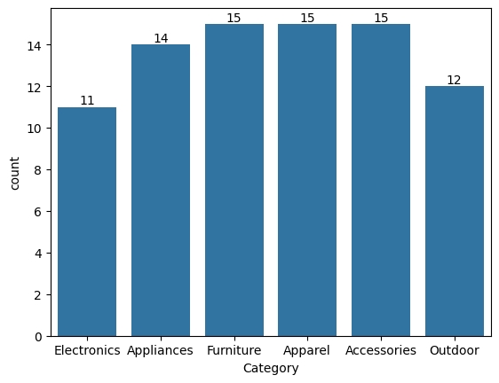
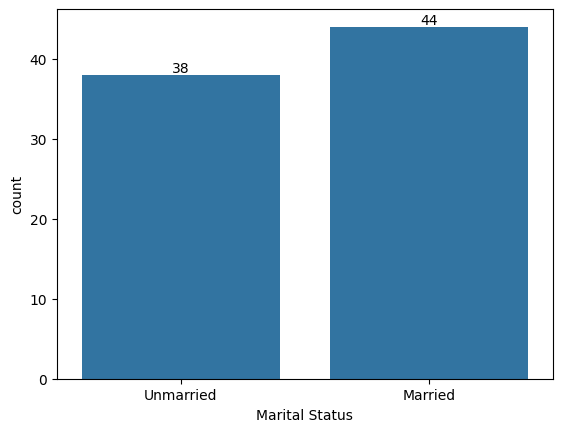
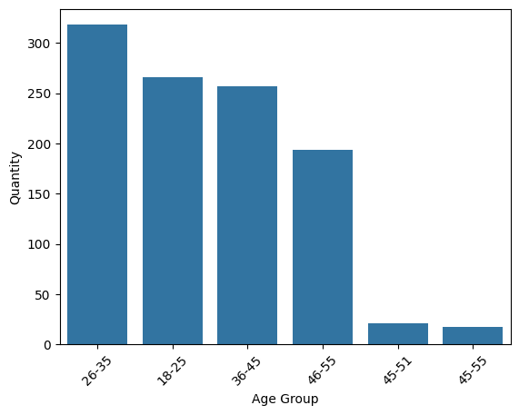
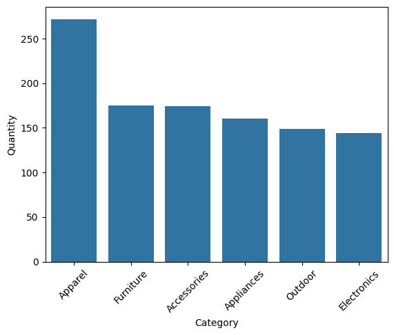
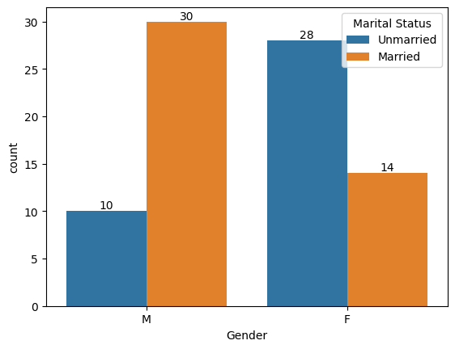
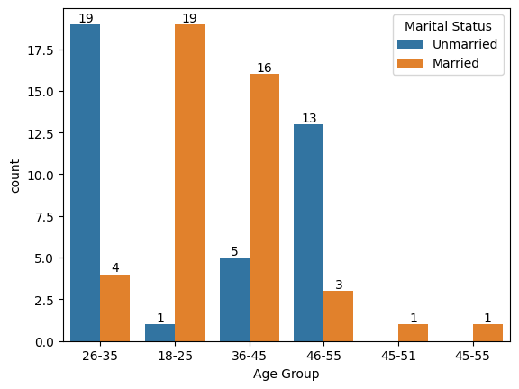
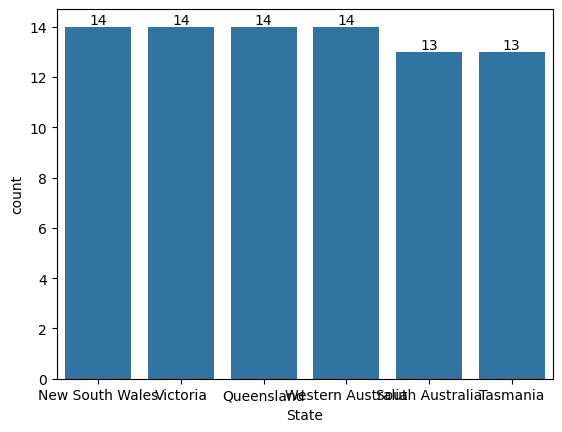
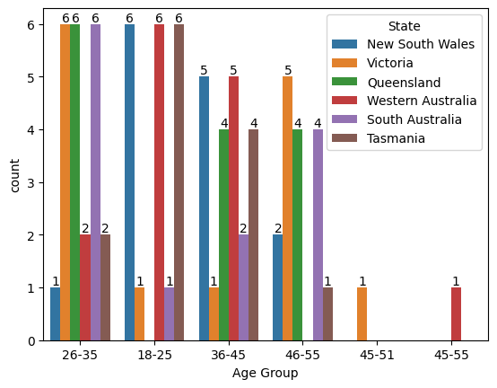
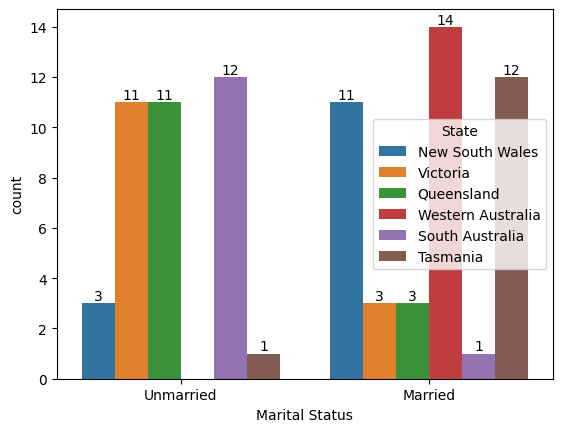

```python
import numpy as np
import pandas as pd
import matplotlib.pyplot as plt 
%matplotlib inline
import seaborn as sns
```


```python
df = pd.read_csv('Nexatech Solutions Data.csv', encoding='unicode_escape')
```


```python
df.info()
```

    <class 'pandas.core.frame.DataFrame'>
    RangeIndex: 82 entries, 0 to 81
    Data columns (total 9 columns):
     #   Column          Non-Null Count  Dtype 
    ---  ------          --------------  ----- 
     0   Product ID   82 non-null     object
     1   Product Name    82 non-null     object
     2   Category        82 non-null     object
     3   Quantity        82 non-null     int64 
     4   Unit Price      82 non-null     object
     5   Age Group       82 non-null     object
     6   Marital Status  82 non-null     object
     7   State           82 non-null     object
     8   Total Revenue   82 non-null     object
    dtypes: int64(1), object(8)
    memory usage: 5.9+ KB
    


```python
df.shape
```


    (82, 9)


```python
df.head(10)
```


<div>
<style scoped>
    .dataframe tbody tr th:only-of-type {
        vertical-align: middle;
    }

    .dataframe tbody tr th {
        vertical-align: top;
    }

    .dataframe thead th {
        text-align: right;
    }
</style>
<table border="1" class="dataframe">
  <thead>
    <tr style="text-align: right;">
      <th></th>
      <th>Product ID</th>
      <th>Product Name</th>
      <th>Category</th>
      <th>Quantity</th>
      <th>Unit Price</th>
      <th>Age Group</th>
      <th>Marital Status</th>
      <th>State</th>
      <th>Total Revenue</th>
    </tr>
  </thead>
  <tbody>
    <tr>
      <th>0</th>
      <td>P001</td>
      <td>Smartphone</td>
      <td>Electronics</td>
      <td>15</td>
      <td>$150.00</td>
      <td>26-35</td>
      <td>Unmarried</td>
      <td>New South Wales</td>
      <td>$2,250.00</td>
    </tr>
    <tr>
      <th>1</th>
      <td>P002</td>
      <td>Laptop</td>
      <td>Electronics</td>
      <td>10</td>
      <td>$200.00</td>
      <td>18-25</td>
      <td>Married</td>
      <td>Victoria</td>
      <td>$2,000.00</td>
    </tr>
    <tr>
      <th>2</th>
      <td>P003</td>
      <td>Headphones</td>
      <td>Electronics</td>
      <td>6</td>
      <td>$149.99</td>
      <td>36-45</td>
      <td>Unmarried</td>
      <td>Queensland</td>
      <td>$899.94</td>
    </tr>
    <tr>
      <th>3</th>
      <td>P004</td>
      <td>Tablet</td>
      <td>Electronics</td>
      <td>5</td>
      <td>$299.99</td>
      <td>26-35</td>
      <td>Married</td>
      <td>Western Australia</td>
      <td>$1,499.95</td>
    </tr>
    <tr>
      <th>4</th>
      <td>P005</td>
      <td>Smartwatch</td>
      <td>Electronics</td>
      <td>7</td>
      <td>$199.99</td>
      <td>36-45</td>
      <td>Unmarried</td>
      <td>South Australia</td>
      <td>$1,399.93</td>
    </tr>
    <tr>
      <th>5</th>
      <td>P006</td>
      <td>TV</td>
      <td>Electronics</td>
      <td>3</td>
      <td>$1,199.99</td>
      <td>46-55</td>
      <td>Married</td>
      <td>Tasmania</td>
      <td>$3,599.97</td>
    </tr>
    <tr>
      <th>6</th>
      <td>P007</td>
      <td>Refrigerator</td>
      <td>Appliances</td>
      <td>4</td>
      <td>$499.99</td>
      <td>36-45</td>
      <td>Married</td>
      <td>Queensland</td>
      <td>$1,999.96</td>
    </tr>
    <tr>
      <th>7</th>
      <td>P008</td>
      <td>Washing Machine</td>
      <td>Appliances</td>
      <td>7</td>
      <td>$399.99</td>
      <td>18-25</td>
      <td>Unmarried</td>
      <td>New South Wales</td>
      <td>$2,799.93</td>
    </tr>
    <tr>
      <th>8</th>
      <td>P009</td>
      <td>Blender</td>
      <td>Appliances</td>
      <td>9</td>
      <td>$49.99</td>
      <td>26-35</td>
      <td>Unmarried</td>
      <td>Victoria</td>
      <td>$449.91</td>
    </tr>
    <tr>
      <th>9</th>
      <td>P010</td>
      <td>Toaster</td>
      <td>Appliances</td>
      <td>11</td>
      <td>$29.99</td>
      <td>18-25</td>
      <td>Married</td>
      <td>Western Australia</td>
      <td>$329.89</td>
    </tr>
  </tbody>
</table>
</div>


```python
pd.isnull(df)
```


<div>
<style scoped>
    .dataframe tbody tr th:only-of-type {
        vertical-align: middle;
    }

    .dataframe tbody tr th {
        vertical-align: top;
    }

    .dataframe thead th {
        text-align: right;
    }
</style>
<table border="1" class="dataframe">
  <thead>
    <tr style="text-align: right;">
      <th></th>
      <th>Product ID</th>
      <th>Product Name</th>
      <th>Category</th>
      <th>Quantity</th>
      <th>Unit Price</th>
      <th>Age Group</th>
      <th>Marital Status</th>
      <th>State</th>
      <th>Total Revenue</th>
    </tr>
  </thead>
  <tbody>
    <tr>
      <th>0</th>
      <td>False</td>
      <td>False</td>
      <td>False</td>
      <td>False</td>
      <td>False</td>
      <td>False</td>
      <td>False</td>
      <td>False</td>
      <td>False</td>
    </tr>
    <tr>
      <th>1</th>
      <td>False</td>
      <td>False</td>
      <td>False</td>
      <td>False</td>
      <td>False</td>
      <td>False</td>
      <td>False</td>
      <td>False</td>
      <td>False</td>
    </tr>
    <tr>
      <th>2</th>
      <td>False</td>
      <td>False</td>
      <td>False</td>
      <td>False</td>
      <td>False</td>
      <td>False</td>
      <td>False</td>
      <td>False</td>
      <td>False</td>
    </tr>
    <tr>
      <th>3</th>
      <td>False</td>
      <td>False</td>
      <td>False</td>
      <td>False</td>
      <td>False</td>
      <td>False</td>
      <td>False</td>
      <td>False</td>
      <td>False</td>
    </tr>
    <tr>
      <th>4</th>
      <td>False</td>
      <td>False</td>
      <td>False</td>
      <td>False</td>
      <td>False</td>
      <td>False</td>
      <td>False</td>
      <td>False</td>
      <td>False</td>
    </tr>
    <tr>
      <th>...</th>
      <td>...</td>
      <td>...</td>
      <td>...</td>
      <td>...</td>
      <td>...</td>
      <td>...</td>
      <td>...</td>
      <td>...</td>
      <td>...</td>
    </tr>
    <tr>
      <th>77</th>
      <td>False</td>
      <td>False</td>
      <td>False</td>
      <td>False</td>
      <td>False</td>
      <td>False</td>
      <td>False</td>
      <td>False</td>
      <td>False</td>
    </tr>
    <tr>
      <th>78</th>
      <td>False</td>
      <td>False</td>
      <td>False</td>
      <td>False</td>
      <td>False</td>
      <td>False</td>
      <td>False</td>
      <td>False</td>
      <td>False</td>
    </tr>
    <tr>
      <th>79</th>
      <td>False</td>
      <td>False</td>
      <td>False</td>
      <td>False</td>
      <td>False</td>
      <td>False</td>
      <td>False</td>
      <td>False</td>
      <td>False</td>
    </tr>
    <tr>
      <th>80</th>
      <td>False</td>
      <td>False</td>
      <td>False</td>
      <td>False</td>
      <td>False</td>
      <td>False</td>
      <td>False</td>
      <td>False</td>
      <td>False</td>
    </tr>
    <tr>
      <th>81</th>
      <td>False</td>
      <td>False</td>
      <td>False</td>
      <td>False</td>
      <td>False</td>
      <td>False</td>
      <td>False</td>
      <td>False</td>
      <td>False</td>
    </tr>
  </tbody>
</table>
<p>82 rows × 9 columns</p>
</div>


```python
pd.isnull(df).sum
```


    <bound method DataFrame.sum of     Product ID  Product Name  Category  Quantity  Unit Price   Age Group  \
    0           False         False     False     False        False      False   
    1           False         False     False     False        False      False   
    2           False         False     False     False        False      False   
    3           False         False     False     False        False      False   
    4           False         False     False     False        False      False   
    ..            ...           ...       ...       ...          ...        ...   
    77          False         False     False     False        False      False   
    78          False         False     False     False        False      False   
    79          False         False     False     False        False      False   
    80          False         False     False     False        False      False   
    81          False         False     False     False        False      False   
    
        Marital Status  State  Total Revenue  
    0            False  False          False  
    1            False  False          False  
    2            False  False          False  
    3            False  False          False  
    4            False  False          False  
    ..             ...    ...            ...  
    77           False  False          False  
    78           False  False          False  
    79           False  False          False  
    80           False  False          False  
    81           False  False          False  
    
    [82 rows x 9 columns]>


```python
df.shape
```


    (82, 9)


```python
df.dropna(inplace=True)
```


```python
df.info()
```

    <class 'pandas.core.frame.DataFrame'>
    RangeIndex: 82 entries, 0 to 81
    Data columns (total 9 columns):
     #   Column          Non-Null Count  Dtype 
    ---  ------          --------------  ----- 
     0   Product ID   82 non-null     object
     1   Product Name    82 non-null     object
     2   Category        82 non-null     object
     3   Quantity        82 non-null     int64 
     4   Unit Price      82 non-null     object
     5   Age Group       82 non-null     object
     6   Marital Status  82 non-null     object
     7   State           82 non-null     object
     8   Total Revenue   82 non-null     object
    dtypes: int64(1), object(8)
    memory usage: 5.9+ KB
    


```python
import pandas as pd

data_test = [['TV', 34], ['Tablet', 45]] 
df_test = pd.DataFrame(data_test, columns=['Product Name', 'Age'])
print(df_test)

```

      Product Name  Age
    0           TV   34
    1       Tablet   45
    


```python
# Assuming df is your DataFrame
df.describe()

```


<div>
<style scoped>
    .dataframe tbody tr th:only-of-type {
        vertical-align: middle;
    }

    .dataframe tbody tr th {
        vertical-align: top;
    }

    .dataframe thead th {
        text-align: right;
    }
</style>
<table border="1" class="dataframe">
  <thead>
    <tr style="text-align: right;">
      <th></th>
      <th>Quantity</th>
    </tr>
  </thead>
  <tbody>
    <tr>
      <th>count</th>
      <td>82.000000</td>
    </tr>
    <tr>
      <th>mean</th>
      <td>13.097561</td>
    </tr>
    <tr>
      <th>std</th>
      <td>6.525562</td>
    </tr>
    <tr>
      <th>min</th>
      <td>3.000000</td>
    </tr>
    <tr>
      <th>25%</th>
      <td>8.000000</td>
    </tr>
    <tr>
      <th>50%</th>
      <td>11.500000</td>
    </tr>
    <tr>
      <th>75%</th>
      <td>18.000000</td>
    </tr>
    <tr>
      <th>max</th>
      <td>33.000000</td>
    </tr>
  </tbody>
</table>
</div>


```python
ax = sns.countplot(x= 'Category',data= df)
for bars in ax.containers:
    ax.bar_label(bars)
```


    

    


```python
ax = sns.countplot(x= 'Marital Status',data= df)
for bars in ax.containers:
    ax.bar_label(bars)
```


    

    


```python
sales_age = df.groupby(['Age Group'], as_index=False)['Quantity'].sum().sort_values(by='Quantity', ascending=False)

# Plotting
sns.barplot(x='Age Group', y='Quantity', data=sales_age)
plt.xticks(rotation=45)  # Rotate x-axis labels if needed
plt.show()
```


    

    


```python
# Assuming 'df' is your DataFrame
Sales_cat = df.groupby(['Category'], as_index=False)['Quantity'].sum()
Sales_cat = Sales_cat.sort_values(by='Quantity', ascending=False).head(10)

sns.barplot(x='Category', y='Quantity', data=Sales_cat)
plt.xticks(rotation=45)  # Rotate x-axis labels if needed
plt.show()
```


    

    


```python
ax= sns.countplot(data =df, x='Gender', hue ='Marital Status')
for bars in ax.containers:
    ax.bar_label(bars)
```


    

    


```python
ax= sns.countplot(data =df, x='Age Group', hue ='Marital Status')
for bars in ax.containers:
    ax.bar_label(bars)
```


    

    


```python
ax = sns.countplot(x= 'State',data= df)
for bars in ax.containers:
    ax.bar_label(bars)
```


    

    


```python
ax= sns.countplot(data =df, x='Age Group', hue ='State')
for bars in ax.containers:
    ax.bar_label(bars)
```


    

    


```python
ax= sns.countplot(data =df, x='Marital Status', hue ='State')
for bars in ax.containers:
    ax.bar_label(bars)
```


    

    


```python

```
